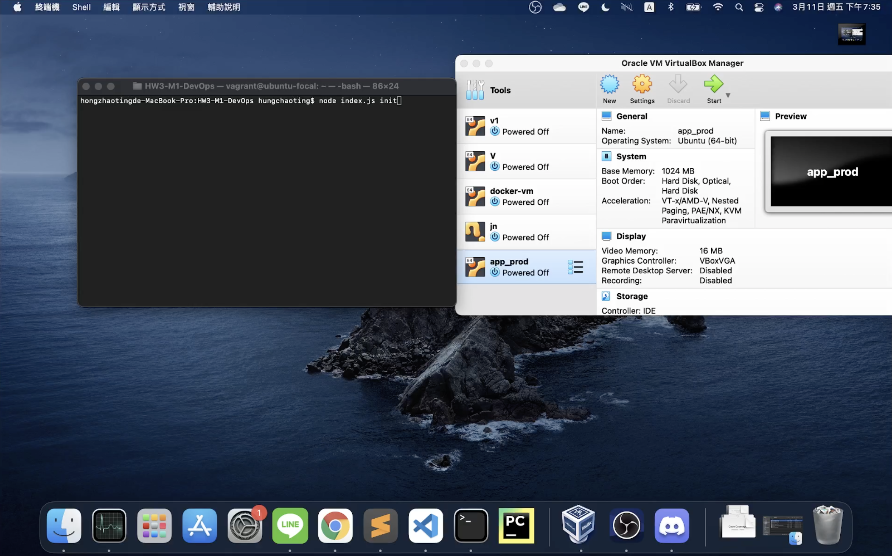

# PROJECT CHECKPOINT - PIPELINE DESGIN

## TASKS BREAKDOWN
| Task | Contibution| Issue Encountered | Resolution | Status |
| --- | --- | --- | --- | --- |
| Discussion on Tasks Breakdown and directory structure of Repo | @chung4 @jlin36 @vyadav | No Issues |  | :white_check_mark: |
| Tasks and Issues creation under `TASK SCHEDULE` Project | @chung4 @jlin36 @vyadav | No Issues |  | :white_check_mark: |
| Automating Pipeline init for Intel Processor  | @chung4 | <li>how to move ssh key to the host and use it for setup part in build.yml</li><li>combine the Intel part with ARM64</li> | <li>add `--sync` parameter in bakerx.yml</li><li>used `processor` variable</li> | :white_check_mark: |
| Automating Pipeline init for Arm64 Processor  | @vyadav | <li>finding basicvm using hasbin library</li><li>fetching IP of running VM</li> | <li>replace bin name from `basicvm` to `vm`</li><li>use `vm ssh-config <vm name>`</li> | :white_check_mark: |
| Decision on stop the VM during pipeline init if running on given IP or name  | @chung4 @jlin36 @vyadav |  |  | :hourglass_flowing_sand: |
| Understanding of iTrust2-v10  | @jlin36 |  |  | :hourglass_flowing_sand: |
| Create a build job specification in build.yml | @chung4 @jlin36 | <li>install mysql and configure its password</li> |  | :hourglass_flowing_sand: |
| Installation dependencies issue during build job | @vyadav |  |  | :hourglass_flowing_sand: |
| Automating build job specification for Intel | @chung4 |  |  | :hourglass_flowing_sand: |
| Automating build job specification for Arm64 | @jlin36 @vyadav |  |  | :hourglass_flowing_sand: |

  
## GitHub Project Screenshot

## Demo Screencast for M1
### Screencast for Intel
 
### Screencast for M1

