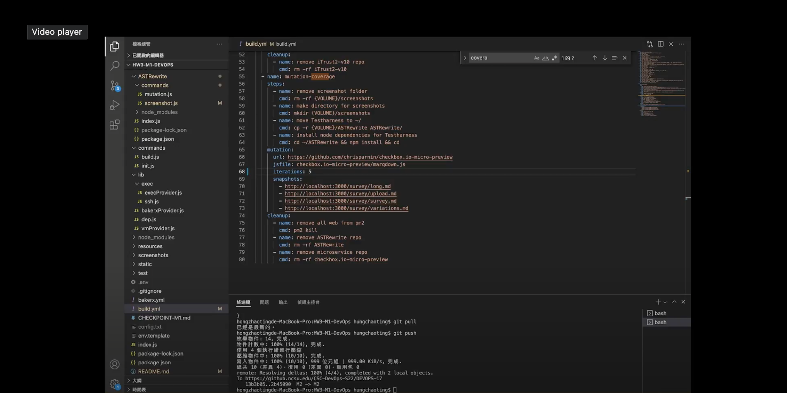

# Pipeline Project - DevOps-17

## Instructions to Run the Project
- clone the repo `git clone https://github.ncsu.edu/CSC-DevOps-S22/DEVOPS-17.git`
- change the directory `cd DEVOPS-17`
- run `npm install` and `npm link`
- use env template to create .env `cp env.template .env`
- update the values for MYSQL Password, GitHub Username, GitHub Token.
- checking if you have at least `5GB memory` for the virtual machine.
- initiate the pipeline `pipeline init` or `node index.js init`
- build the pipeline `pipeline build <job-name> <path to build.yml>` or `node index.js build <job-name> <path to build.yml>`
- set up prod environment `pipeline prod up` or `node index.js prod up`
- deploy pipeline `pipeline deploy <path to inventory> <job-name> <path to build.yml>` or `node index.js deploy <path to inventory> <job-name> <path to build.yml>`

** VM name is set as `M1`, `M2`, `M3` for respective milestones

** VM information is stored at DEVOPS-17/config.txt . It is created after execution of `init`.

** Droplets information is stored at DEVOPS-17/inventory.txt. It is created after execution of `prod up`.

* Values of [job-name] are as follows:
  * `itrust-build` for running iTrust2
  * `mutation-coverage` for running mutation coverage
  * `deploy-iTrusts` for deploying iTrust2


## Description for `.env` file
In the .env file, we need to set up the following variables to run the building jobs:
```
MYSQL_PSSW= 
GIT_USER=
TOKEN=
VOLUME=
PROVISION_TOKEN=
PROVISION_PRIVATE_PATH=
```
- MYSQL_PSSW: the password of the 'root' user for mysql
- GIT_USER: a git account that can access the project on https://github.ncsu.edu/.
- TOKEN: the token created by your git account
- VOLUME: the shared volume value in case of bakerx is `\bakerx`, whereas in case of basicvm is `shared/cwd`
- PROVISION_TOKEN: token for digital ocean account
- PROVISION_PRIVATE_PATH: the path of public ssh key on the local machine, for the key added to digital ocean.

## Process Involved in Setting Up the Pipeline
- Used the learning from class and homework assignments on:
  - child_process.exec to execute shell commands.
  - start VM using `bakerx` and `basicvm`.
- extract ip, user, ssh key path of the VM using:
  - `bakerx ssh-info <VM-NAME>`
  - `vm ssh-config <VM-NAME>`
- loading .env in node.js
- defining steps in build.yml for installations and configurations:
  - installing java, mysql, maven, git.
  - setting password for mysql only when not already set
  - synchronize the system time of VM with time servers: to avoid broken packages during installations.
- understanding the functionality of iTrust2
- using github token to clone the private repo
- `sed` and `awk` commands to replace keywords in a file
- using .ssh/config file to ssh with a hostname
  - eg: `ssh M1` where config file is:
  ```shell
  Host M1
      HostName 192.168.xx.xxx
      User ubuntu
      IdentityFile <path to ssh key>
      StrictHostKeyChecking no
      UserKnownHostsFile /dev/null
  ```
- executing shell cmd on VM remotely from local machine by prepending the ssh cmd.

## Machines that Developers have tested on:
- macOS Monterey with a M1 processor
- macOS Big Sur with an Intel processor

## Issues Encountered during the Process of Automation
- Encountered broken package during installation occasionally due to system time drift. 
  - **Solution**: used `sudo systemctl restart systemd-timesyncd.service` to explicitly sync the system time.
- MySQL password set command failed on building the pipeline multiple times.
  - **Solution**: used a new user for which the password can be changed as number of times as required.
- The new MySQL user created for iTrust2 doesn't have privileges to manipulate MySQL.
  - **Solution**: granted the new user with all privileges to the MySQL.
- Default buffer size of child_process is 200KB whereas output `mvn test` command was almost 1.9 MB. So, entire stdout could not be displayed.
  - **Solution**: explicitly updated the max buffer size of child_process to 2 MB. 
- chromium installation getting stuck on VM.Upgraded the memory size to 5MB.
  - **Solution**: Upgraded the memory size to 5MB. 

## Demo Screencast for M1
### Screencast for Intel
[](https://drive.google.com/file/d/1RGOJzXG19odPBtmXrGc9IQB3BXlwUIaD/view?usp=sharing "Intel Demo")<br/>
### Screencast for M1
[](https://youtu.be/35rETvH5RFE)

## [Checkpoint Report](https://github.ncsu.edu/CSC-DevOps-S22/DEVOPS-17/blob/main/CHECKPOINT-M1.md)
This checkpoint report includes the tasks we have completed along with the team contributions, the issues we have faced while implementing or completing tasks, and what work remains after this checkpoint. There will also be a screenshot of the Github Project at the time this Checkpoint document was created.

## Demo Screencast for M2
### Screencast for Intel
[](https://drive.google.com/file/d/1ZukNw2L7_WN-hRPG59JYtsD6k8TpY4xr/view?usp=sharing "Intel Demo")<br/>
### Screencast for M1
[](https://youtu.be/vUVsejQrMa0)

## [Milestone 2 Report](https://github.ncsu.edu/CSC-DevOps-S22/DEVOPS-17/blob/main/MILESTONE-M2.md)
This milestone report includes the tasks we have completed along with the team contributions, the issues we have faced while implementing or completing tasks along with their resolutions and the learnings got from them. There will also be a screenshot of the Github Project Board at the time this Milestone document was documented.

### [Link for 1000 Iteration Images](https://drive.google.com/drive/folders/1uM1DVPdqmU7GFLpYvD0snBUEXzjhc3zK?usp=sharing)

### [Link for 1000 Iteration Mutation Coverage Report](report.txt)
